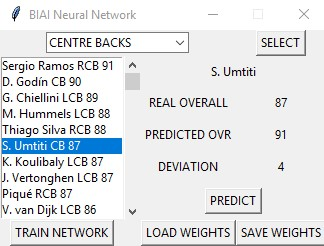

# BIAI NEURAL NETWORK
> Project made during Biologically Inspired Artificial Intelligence course at university.

## General info
It's a simple neural network which predicts FIFA player overall based on his skills and position on the pitch.

## Screenshot

## Technologies
* Python 3.7
* NumPy
* Tkinter

## Status
Project is: _finished_ .

